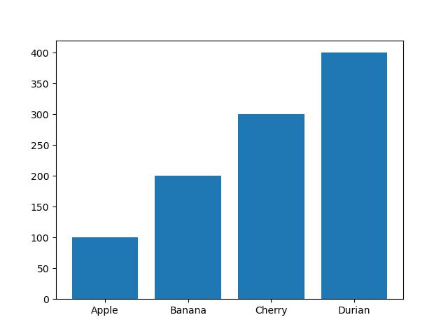
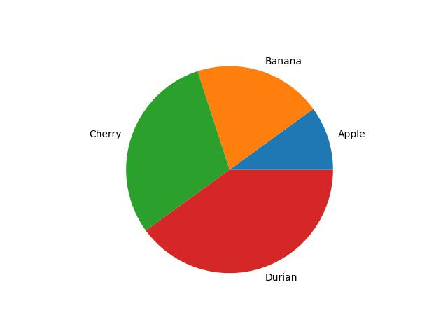
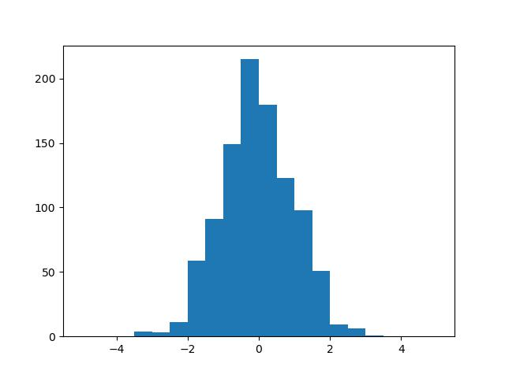
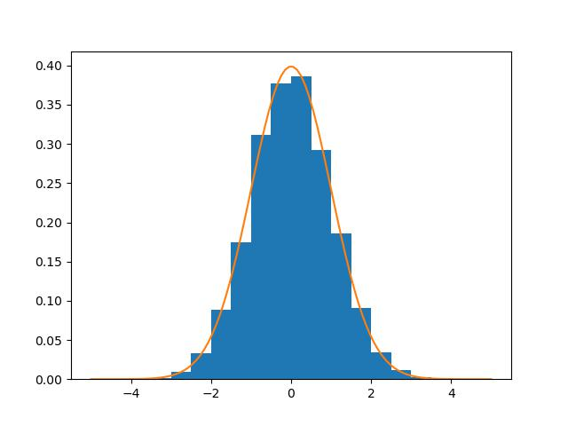

Matplotlibの基礎
===

## Matplotlibとは？

Matplotlibはデータ可視化のためのPythonのライブラリで、様々なグラフを細かく調整を入れて作成することができる。また、今日は類似するライブラリとして[Seaborn](https://seaborn.pydata.org/)や[Plotly](https://plotly.com/python/), [Bokeh](https://bokeh.org/)などがあるが、この中では比較的単純 (がゆえに綺麗な可視化をしようとすると手間がかかる...)で、それ故、現在でも広く用いられているライブラリである。特に、Matplotlibは文法がMATLABと類似しているため、MATLABを使い慣れている読者には親しみやすいかもしれない。

本講義では、その単純さからMatplotlibを用いるが、必要に応じて、Seaborn, Plotly, Bokehのギャラリーなどを見て、自分の好みのライブラリを使うのが良いだろう。

## 基本的なグラフの作成

### 空の画面を表示する

```python
import matplotlib.pyplot as plt

plt.figure()
plt.show()
```

### 折れ線グラフ

折れ線グラフは `plt.plot` を用いて作成できる。これを用いて、sin関数を $[-\pi, \pi]$ の範囲で書いてみよう。データの準備にはNumPyの `numpy.linspace` 関数を使うと良い。

```python
# データの用意
xs = np.linspace(-np.pi, np.pi, 100)  # [-pi, pi]を100分割
ys = np.sin(xs)
# 折れ線グラフの描画
plt.plot(xs, ys)
plt.show()
```


### 散布図

散布図は `plt.scatter` を用いて作成できる。これを用いて、二次元正規分布に従うデータの散布図を作ってみよう。この際、`plt.xlim`, `plt.ylim` を使った範囲指定と、`plt.gca().set_aspect`を用いたグラフの縦横比の指定をしておこう。

```python
xs, ys = np.random.normal(size=(2, 100))
plt.scatter(xs, ys)
plt.xlim([-3, 3])
plt.ylim([-3, 3])
plt.axis().set_aspect('equal')
plt.show()
```


### 棒グラフ

棒グラフはラベルと、各ラベルに対する値の組み合わせによって作成する。

```python
labels = ['Apple', 'Banana', 'Cherry', 'Durian']
prices = [100, 200, 300, 400]
plt.bar(labels, prices)
plt.show()
```




### 円グラフ

円グラフを描く関数 `plt.pie` の使い方は棒グラフのものとほとんど同じだが、引数の指定の仕方が微妙に異なるので注意。

```python
labels = ['Apple', 'Banana', 'Cherry', 'Durian']
prices = [100, 200, 300, 400]
plt.pie(prices, labels=labels)
plt.show()
```



### ヒストグラム

ヒストグラムは `plt.hist` 関数を用いれば、グラフの作成とヒストグラム自体の計算を両方行うことができる。以下では、正規分布に従う乱数を1000個作成して、その分布がどうなっているかをヒストグラムで表示している。また、以下のコードで使用してはいないものの `freq` と `ranges` はそれぞれヒストグラムの頻度と、その頻度の範囲を示す値の配列 (ビン数+1の長さ)となっている。

```python
x = np.random.normal(size=(1000))
freq, ranges, _ = plt.hist(x, bins=20, range=[-5, 5])
plt.show()
```



また、 ヒストグラムを描画する際には、その合計が1になるように正規化することも多い。そのようにしたい場合には `plt.hist` の引数に `density=True` を指定する

また、これに加えて、先ほどの `plt.plot` を用いて正規分布 (平均が0で分散が1のもの)を折れ線グラフでプロットすると、より分かりやすい。

```python
# ヒストグラムの表示
x = np.random.normal(size=(10000))
w = np.ones(len(x)) / len(x)
plt.hist(x, bins=20, range=[-5, 5], density=True)
# 正規分布関数をプロット
xs = np.linspace(-5, 5, 100)
ys = np.exp(-0.5 * xs * xs) / (np.sqrt(2.0 * np.pi))
plt.plot(xs, ys)
plt.show()
```



### グラフを保存する

グラフを保存するには `plt.savefig` を用いる。この際、JPEGやPNGといったラスタ形式のフォーマットの他、EPSやPDFといったベクタ形式の画像も出力できる。

```python
# グラフを描画するコード
...
plt.savefig('image.jpg')
# plt.showが先でも構わないが、後にしておけばグラフ表示時にファイルが保存される
plt.show()  
```

---

#### 閑話休題: ラスタ画像とベクタ画像

---

## グラフの調整

Colors, markers, and linestyles
Plot labels, titles, and legends
Axis labels and tick marks
Gridlines and background colors
Text annotations and arrows
Logarithmic and other non-linear axes
Error bars

Advanced Plotting:

Subplots and multiple plots in a single figure
Stacked plots and grouped bar plots
3D plots (scatter, surface, wireframe, etc.)
Heatmaps and color maps
Contour plots and filled contour plots
Polar plots and other coordinate systems
Stream plots and quiver plots
Plotting with Pandas and Seaborn (optional):

Integrating Matplotlib with Pandas for DataFrame plotting
Introduction to Seaborn, a statistical data visualization library built on top of Matplotlib
Customizing Matplotlib:

Using different styles and themes
Customizing Matplotlib's configuration (rcParams)
Creating custom colormaps


Interactive Plots (optional):

Introduction to interactive plotting with Matplotlib
Using widgets and event handling for interactive visualization
End-to-End Data Visualization Project using Matplotlib:

Walkthrough of a complete data visualization project using Matplotlib
Interpretation and communication of results

## 練習問題


## より深く学びたい人は？

