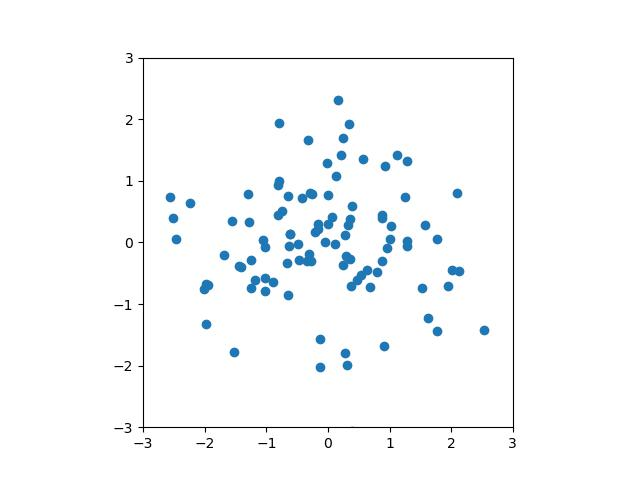

Matplotlibの基礎
===

## Matplotlibとは？

Matplotlibはデータ可視化のためのPythonのライブラリで、様々なグラフを細かく調整を入れて作成することができる。また、今日は類似するライブラリとして[Seaborn](https://seaborn.pydata.org/)や[Plotly](https://plotly.com/python/), [Bokeh](https://bokeh.org/)などがあるが、この中では比較的単純 (がゆえに綺麗な可視化をしようとすると手間がかかる...)で、それ故、現在でも広く用いられているライブラリである。特に、Matplotlibは文法がMATLABと類似しているため、MATLABを使い慣れている読者には親しみやすいかもしれない。

本講義では、その単純さからMatplotlibを用いるが、必要に応じて、Seaborn, Plotly, Bokehのギャラリーなどを見て、自分の好みのライブラリを使うのが良いだろう。

## 基本的なグラフの作成

### 空の画面を表示する

```python
import matplotlib.pyplot as plt

plt.figure()
plt.show()
```

### 折れ線グラフ

実験としてsin関数のグラフを $[-\pi, \pi]$ の範囲で書いてみよう。データの準備にはNumPyの `numpy.linspace` 関数を使うと良い。

```python
# データの用意
xs = np.linspace(-np.pi, np.pi, 100)  # [-pi, pi]を100分割
ys = np.sin(xs)
# 折れ線グラフの描画
plt.plot(xs, ys)
plt.show()
```


### 散布図

実験として、二次元正規分布に従うデータの散布図を作ってみよう。

```python
xs, ys = np.random.normal(size=(2, 100))
plt.scatter(xs, ys)
plt.show()
```



### 棒グラフ

### 円グラフ

### ヒストグラム

Line plots
Scatter plots
Bar plots (vertical and horizontal)
Histograms
Pie charts
Box plots

### グラフを保存する


---

#### 閑話休題: ラスタ画像とベクタ画像

---

## グラフの調整

Colors, markers, and linestyles
Plot labels, titles, and legends
Axis labels and tick marks
Gridlines and background colors
Text annotations and arrows
Logarithmic and other non-linear axes
Error bars

Advanced Plotting:

Subplots and multiple plots in a single figure
Stacked plots and grouped bar plots
3D plots (scatter, surface, wireframe, etc.)
Heatmaps and color maps
Contour plots and filled contour plots
Polar plots and other coordinate systems
Stream plots and quiver plots
Plotting with Pandas and Seaborn (optional):

Integrating Matplotlib with Pandas for DataFrame plotting
Introduction to Seaborn, a statistical data visualization library built on top of Matplotlib
Customizing Matplotlib:

Using different styles and themes
Customizing Matplotlib's configuration (rcParams)
Creating custom colormaps


Interactive Plots (optional):

Introduction to interactive plotting with Matplotlib
Using widgets and event handling for interactive visualization
End-to-End Data Visualization Project using Matplotlib:

Walkthrough of a complete data visualization project using Matplotlib
Interpretation and communication of results

## 練習問題


## より深く学びたい人は？

