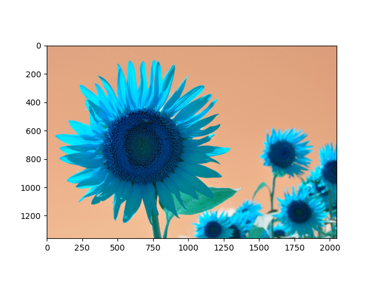

OpenCVの基本
===

OpenCVとは元々Intel社が1999年から開発を開始した画像処理およびコンピュータビジョン用のライブラリでバージョン1.0が2006年に公開された当初はC言語で書かれていた。その後、開発が進められ、現在の最新バージョンである4.x系はPythonを含む非常に多くの言語でラッパーが公開されている。OpenCVで行える計算は画像の読み書きや、単純な画像フィルタの他、画像からの三次元復元や機械学習など幅広いが、ここでは基本的な機能に絞って解説する。

## 画像の読み書き

まずは講義の[GitHub](https://github.com/tatsy/sds-1284-ml/tree/master/Images)にアクセスして、3枚ある画像から好きなものを一つダウンロードしましょう。その画像 (以下は`sunflower.jpg`とする)をIPythonを起動しているディレクトリと同じディレクトリに配置して、画像を読み込んでみましょう。

なお、IPythonでどこのディレクトリを開いているか分からなくなった場合には、

```python
import os
os.getcwd()
```

とすることで、現在IPythonが実行されているディレクトリを調べることができます。ただ、このようなことが起こらないように、**講義用の作業用ディレクトリを作っておくのが一番おすすめ**です。

さて、画像の用意ができたら、以下のコードをタイプして、画像を読み込みます。

```python
import cv2
img = cv2.imread('sunflower.jpg', cv2.IMREAD_COLOR)
```

もし画像の読み込みに失敗すると`img`が`None`となるので、以下のようなエラーチェックを入れておくと、些細な間違いを防ぐことができます。

```python
if img is None:
  raise Exception('Failed to load image!')
```

画像が読み込めたら`shape`メソッドで大きさを確認してみましょう。正しく読み込めていれば、サイズは2048x1360となっているはずです。ただし、OpenCVは画像の大きさを「高さ」×「幅」で表現しているため、幅が最初に来ること、そしてカラー画像として読み込んでいるので、赤・緑・青の色の強さを表わすチャネル数である3が末尾に追加されて以下のように出力されます。

```python
print(img.shape)   # (1360, 2048, 3)
```

次に、ここで読みこんだ画像をMatplotlibを使って確認してみましょう。画像の表示には`plt.imshow`を使います。

```python
plt.imshow(img)
plt.show()
```



ご覧の通り、色合いがおかしな画像になっています。これは、OpenCVでカラー画像を読み込むと色を表わす3チャネルが赤・緑・青 (RGB)の順番ではなく青・緑・赤 (BGR)の逆順になっているためで、これを直すには以下のように色表現を変更する必要があります。

```python
img = cv2.cvtColor(img, cv2.COLOR_BGR2RGB)
```

この処理を加えた後、同様に`plt.imshow`を用いて画像を表示してみると、以下のような正しい出力が得られます。


---

#### 閑話休題: 画像の色表現

上記のプログラムではOpenCVを用いてカラー画像を読み込みましたが、各画素の色は赤・緑・青の三要素を用いて表わされていました。これは、光の三原色と呼ばれる色で、人間の目が捉える様々な波長の光のうち、特徴的な三つの成分を取りだして表現しているものと考えられます (厳密には各波長の感度には幅がある)。デジタル画像の表現形式は、この光の三原色を基本としたRGB表色に従っていることが一般的です (例えばJPEGやPNGなど)。

光の三原色は色を混ぜると白に近づくことで、例えばRGBの各値が一般的なデジタル画像における最大値である(255, 255, 255)を取ると、それは白色に対応します。このような重ね合わせることで明るくなっていく表色系のことを加法混色といいます。逆に、絵の具を混ぜた時のように、色を重ねるごとに黒に近づいていく表色系のことを減法混色といいます。

デジタル画像の保存にRGB形式が広く用いられる一方で、実際の応用に画像(や動画)を用いる際には、別の表色系が好まれることがあります。例えば、テレビ映像を伝送する際には、帯域を削減する目的でYUVやYCbCrといった異なる表色が用いらます。また、プリンタに対して色情報を送るときには加法混色に従うRGB表色系ではなく、プリンタのインクが従う減法混色系の一種であるCMYK表色系 (C=シアン、M=マゼンタ、Y=イエロー、K=キープレート=黒)が用いられるのが一般的です。

---

## 画像に対する基本操作


